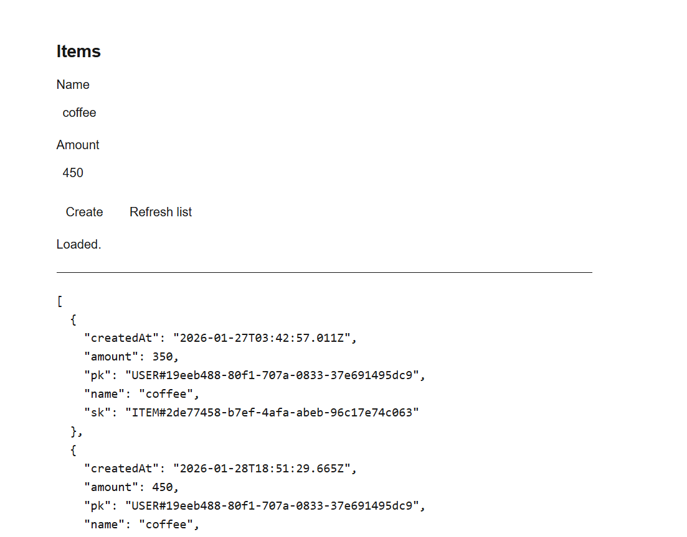
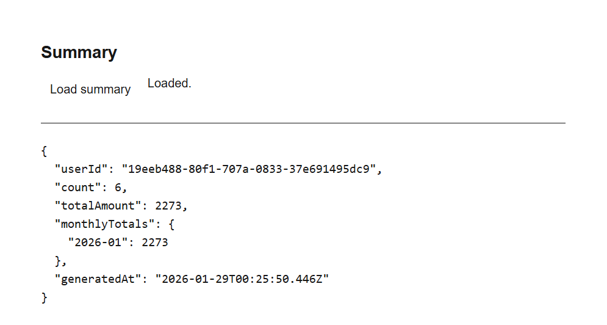

# Cloud Platform Projects (AWS | Serverless + ECS)

This repository contains two AWS-based projects showcasing different production architectures:
serverless and container-based.

- **Project A — Serverless SaaS (CDK)**  
  Cognito-authenticated HTTP API built with AWS Lambda and DynamoDB, including scheduled processing and CI/CD.
- **Project B — ECS Production on Fargate (Terraform)**  
  Container-based application running on ECS Fargate with ALB, RDS, and infrastructure managed via Terraform.

---
## CI/CD Flow (Project B)

This project uses GitHub Actions with OIDC and Terraform-managed IAM for secure, fully automated deployments.

Flow:

1. Push to `main`
2. GitHub Actions assumes AWS role via OIDC (no long-lived credentials)
3. Build Docker image
4. Tag image with an immutable tag (`<commit-sha>-<run-id>`)
5. Push image to ECR
6. Register new ECS task definition revision
7. Update ECS service (rolling deployment)
8. Wait for service stability

Key design decisions:

- OIDC authentication (no static secrets)
- Immutable image tags (no `latest`)
- Least-privilege IAM
- Task/execution roles restricted with `iam:PassRole`
- Infrastructure managed via Terraform
- Operational incidents documented under `docs/incidents/`

Result:
Push → deploy → healthy with zero manual steps.

### Deployment verification (smoke test)

After each deployment, the pipeline checks:

- GET /health
- GET /db-check

Target:
http://project-b-dev-alb-1457945794.ap-southeast-2.elb.amazonaws.com


## Where to start

- **System overview & architecture**: `docs/overview.md`
- **Operational documentation**: `docs/runbooks/`, `docs/incidents/`
- **Engineering standards & conventions**: `docs/standards.md`
- **Deployment outputs**: CloudFront frontend URL and HTTP API endpoint are available as CDK stack outputs
---

## Repository layout

- `cdk/` — Infrastructure for Project A (AWS CDK, TypeScript)
- `apps/`
  - `apps/a-api/` — Serverless API (Lambda)
  - `apps/a-web/` — Minimal frontend
  - `apps/b-api/` — Container-based API
  - `apps/b-web/` — Minimal frontend for validation
- `infra/` — Infrastructure for Project B (Terraform)
- `docs/` — Architecture notes, runbooks, incidents, and supporting documentation

---

## API Testing (Postman)

A Postman collection is provided to verify the authenticated API flow.

- Cognito authentication via `InitiateAuth`
- Access token automatically stored at the collection level
- Protected endpoints inherit Bearer authentication
- Diagnostics request included to confirm unauthorized access is blocked

**Typical flow:**

1. Authenticate via Cognito
2. Create items (`POST /items`)
3. Retrieve aggregates (`GET /summary`)

---

## Screenshots

### Items (Create & List)



### Summary (Aggregated view)



---

## How to run

### API (Project A)

The API is deployed using AWS CDK and exposed via Amazon API Gateway (HTTP API).  
Authentication is handled by Amazon Cognito using JWTs.

**Main endpoints:**

- `POST /items` — create an item (authenticated)
- `GET /items` — list user items (authenticated)
- `GET /summary` — aggregated summary per user (authenticated)

---

### Frontend (Next.js)

#### Local development
```bash
cd apps/a-web
npm install
npm run dev
```

Create `.env.local`:
```env
NEXT_PUBLIC_API_BASE_URL=https://<api-id>.execute-api.<region>.amazonaws.com
```

Then open:
```
http://localhost:3000
```

#### Deployed (S3 + CloudFront)

The frontend is deployed as static assets to Amazon S3 and served via CloudFront.

**Deployment outputs (from CDK):**

- `CdkStack.FrontendUrl` — CloudFront distribution URL
- `CdkStack.HttpApiUrl` — API Gateway (HTTP API) base URL

**Note:** The CloudFront domain (frontend) and the API Gateway domain are separate.  
The frontend sends API requests directly to the API Gateway endpoint.

---

## Architecture (Project A)

- **API**: Amazon API Gateway (HTTP API)
- **Compute**: AWS Lambda (Node.js / TypeScript)
- **Auth**: Amazon Cognito User Pool (JWT)
- **Database**: Amazon DynamoDB (on-demand)
- **Scheduler**: Amazon EventBridge
- **IaC**: AWS CDK (TypeScript)
- **Frontend**: Next.js
- **Hosting**: Amazon S3 (private) + CloudFront (OAC)

---

## Cost notes

This project is designed to keep development costs low:

- DynamoDB uses on-demand billing
- Lambda functions are event-driven
- Non-production environments use DESTROY removal policies
- Production environments are intended to apply retention policies, alarms, and stricter controls.